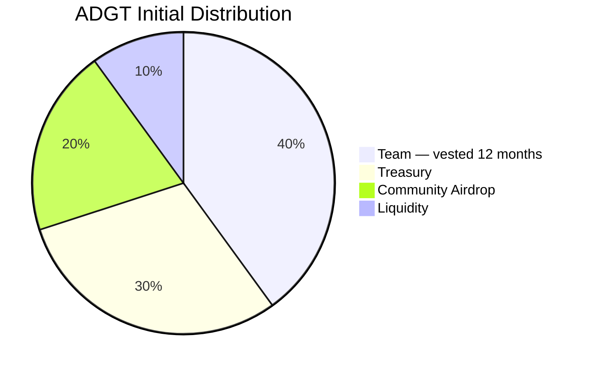

# Token Distribution Diagram

Token: **AITU DAO Governance Token (ADGT)**  
Initial supply: **1,000,000 ADGT**

| Allocation | Percent | Tokens | Receiver |
|---|---:|---:|---|
| Team | 40% | 400,000 ADGT | `TokenVesting` contract, released linearly to team beneficiary over 12 months |
| Treasury | 30% | 300,000 ADGT | `Treasury` contract controlled by `TimelockController` |
| Community airdrop | 20% | 200,000 ADGT | Community airdrop address |
| Liquidity | 10% | 100,000 ADGT | Liquidity address |

The team allocation is minted directly to the `TokenVesting` contract during token construction, so unlocked team tokens are never held by a normal externally owned account at launch.
